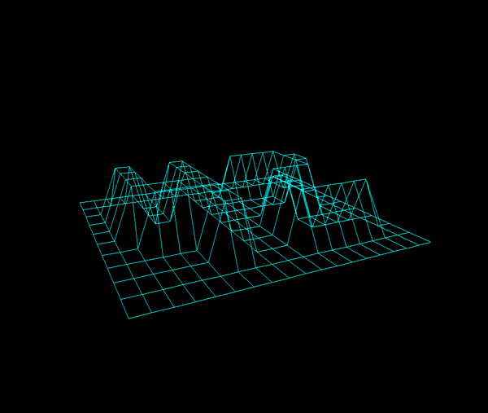

# FDF (fil de fer) - Wire Frame Machine

## About

This program creates a 3D wireframe projection from a textfile. A folder of maps are provided but it will work for any correctly formated file. There are 3 color modes and live user control for rotate, zooom and increase/decrease height. See below for the full list of commands. This project is part of the [42 Silicon Valley](42.us.org) curriculum.

## Installation
*Note: This was compiled on and run on Mac OS 10.13, 2015, 3.2 GHz Intel Core i5*
1. Clone the source with git:
   ```bash
   git clone https://github.com/tfdiaz/fdf
   cd fdf
   ```
2. Compile and Run 
   ```bash
    make && make clean
    ./fdf maps/42.fdf
    ```
If you run into any issues let me know.

## User Guide
* *Key* UP Arrow - Rotate up
* *Key* DOWN Arrow - Rotate down
* *Key* RIGHT Arrow - Rotate clockwise
* *Key* LEFT Arrow - Rotate counterclockwise
* *Key* R - Reset image
* *Key* W - Zoom in
* *Key* S - Zoom out
* *Key* A - Pan xy direction left
* *Key* F - Pan xy direction right
* *Key* E - Increase Z value in map
* *Key* Q - Decrease Z value in map
* *Key* + - Increase focal length
* *Key* - - Decrease focal length
* *Key* 1 - Flat color mode
* *Key* 2 - Red color mode based on Z value
* *Key* 3 - Multi-color mode based on Z value

## Map Format
The fdf file extension is needed for new maps. Below is an example map. Underneath that is the rendering from the program.
```bash
cat maps/42.fdf
0  0  0  0  0  0  0  0  0  0  0  0  0  0  0  0  0  0  0
0  0  0  0  0  0  0  0  0  0  0  0  0  0  0  0  0  0  0
0  0 10 10  0  0 10 10  0  0  0 10 10 10 10 10  0  0  0
0  0 10 10  0  0 10 10  0  0  0  0  0  0  0 10 10  0  0
0  0 10 10  0  0 10 10  0  0  0  0  0  0  0 10 10  0  0
0  0 10 10 10 10 10 10  0  0  0  0 10 10 10 10  0  0  0
0  0  0 10 10 10 10 10  0  0  0 10 10  0  0  0  0  0  0
0  0  0  0  0  0 10 10  0  0  0 10 10  0  0  0  0  0  0
0  0  0  0  0  0 10 10  0  0  0 10 10 10 10 10 10  0  0
0  0  0  0  0  0  0  0  0  0  0  0  0  0  0  0  0  0  0
0  0  0  0  0  0  0  0  0  0  0  0  0  0  0  0  0  0  0
```



*Color mode 1 - file 42.fdf*


*Color mode 3 - file t2.fdf*


*Color mode 1 - file t2.fdf*

*If you zoom in close the map will wrap over creating a rather cool look this is due to the projection algorithm that*

## Technical Details

The line algorithm is done using Bressenham's method and the projection is done by treating the space with polar coordinates rather than cartesian. This makes the user shifts in height and angle easy to deal with. See
> src/projection.c
> 
for more info.